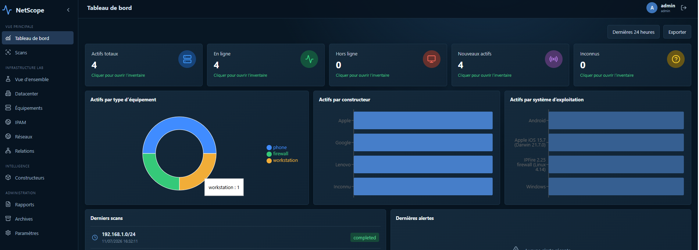

# NetScope

NetScope est une application web auto-hébergée pour découvrir, inventorier et documenter un réseau. Elle réunit l’inventaire des équipements, les scans, l’IPAM, les VLAN, les sites Datacenter, les services, SNMPv3 et les relations LLDP/CDP.



Ce guide est prévu pour une première installation, même sans expérience de Docker.

## 1. Ce qu’il faut avant de commencer

Il vous faut une machine Linux avec :

- Docker Engine 24 ou plus récent ;
- Docker Compose v2 (`docker compose`) ;
- au moins 2 Go de mémoire vive et 10 Go d’espace libre ;
- un compte autorisé à exécuter Docker.

Vérifiez l’installation :

```bash
docker --version
docker compose version
```

Si ces commandes ne fonctionnent pas, installez Docker en suivant la documentation de votre distribution. NetScope n’a pas besoin d’installer Python, Node.js ou PostgreSQL sur la machine : Docker les fournit dans les conteneurs.

## 2. Préparer la configuration

Placez-vous dans le dossier du projet :

```bash
cd /chemin/vers/soc
cp .env.example .env
chmod 600 .env
```

Ouvrez ensuite `.env` avec un éditeur :

```bash
nano .env
```

Exemple de configuration :

```dotenv
POSTGRES_PASSWORD=remplacez-par-un-mot-de-passe-long
SECRET_KEY=remplacez-par-une-cle-aleatoire-de-32-caracteres-minimum
MASTER_ENCRYPTION_KEY=remplacez-par-une-autre-cle-aleatoire-longue
ADMIN_USERNAME=admin
ADMIN_PASSWORD=remplacez-par-un-mot-de-passe-administrateur
HTTP_PORT=8080
```

Générez facilement des secrets aléatoires :

```bash
openssl rand -hex 32
```

Utilisez une valeur différente pour `POSTGRES_PASSWORD`, `SECRET_KEY`, `MASTER_ENCRYPTION_KEY` et `ADMIN_PASSWORD`. Conservez `MASTER_ENCRYPTION_KEY` : la perdre rendrait les identifiants SNMP enregistrés illisibles.

Ne transmettez jamais le fichier `.env` et ne le placez pas dans Git.

## 3. Installer et démarrer NetScope

Depuis le dossier du projet :

```bash
docker compose up -d --build
```

Le premier lancement peut prendre plusieurs minutes. Docker télécharge les images, construit l’application puis initialise PostgreSQL.

Contrôlez l’état des services :

```bash
docker compose ps
```

`backend-api` et `frontend` doivent être indiqués comme `healthy`. Les services attendus sont :

- `frontend` : interface web et proxy HTTP ;
- `backend-api` : API et authentification ;
- `scanner` : Nmap, ARP, DNS et SNMP ;
- `worker` et `scheduler` : tâches asynchrones ;
- `postgres` : base de données ;
- `redis` : file de tâches et protection de connexion.

Ouvrez ensuite :

- interface : <http://localhost:8080> ;
- documentation API : <http://localhost:8080/api/docs>.

Depuis un autre ordinateur, remplacez `localhost` par l’adresse IP du serveur, par exemple `http://192.168.1.20:8080`.

Connectez-vous avec `ADMIN_USERNAME` et `ADMIN_PASSWORD` définis dans `.env`. Après la première connexion, ouvrez **Paramètres** pour activer le MFA et, si nécessaire, changer le mot de passe.

## 4. Première configuration recommandée

### Ajouter un réseau et configurer le DNS

1. Ouvrez **Infrastructure Lab → Réseaux**.
2. Ajoutez le réseau au format CIDR, par exemple `192.168.1.0/24`.
3. Ouvrez **IPAM** et vérifiez que le préfixe est présent.
4. Dans **Paramètres → Résolution DNS**, saisissez le serveur DNS interne.
5. Entrez une IP connue et utilisez **Tester le PTR**.

Un serveur DNS interne permet de retrouver les noms d’hôtes. La box Internet, Active Directory, Pi-hole ou le serveur DNS de l’entreprise peut fournir cette résolution.

### Lancer un premier scan

1. Ouvrez **Scans**.
2. Sélectionnez le profil **Inventaire rapide**.
3. Choisissez un réseau privé enregistré.
4. Lancez le scan et attendez l’état `completed`.
5. Consultez **Équipements** pour ouvrir les fiches découvertes.

Commencez par un petit réseau `/24`. Les scans de réseaux très larges sont volontairement protégés.

### Configurer un Datacenter

Le menu **Datacenter** permet de construire une source de vérité manuelle :

1. créez un site ou un lieu ;
2. enregistrez d’abord son réseau dans **Réseaux/IPAM** ;
3. créez un VLAN et associez-le à ce préfixe ;
4. ajoutez les équipements avec leur IP, description, système et services ;
5. contrôlez les IP prises, disponibles et le taux d’occupation du VLAN.

NetScope refuse une IP hors du préfixe du VLAN ou déjà utilisée.

### Configurer SNMPv3

SNMPv3 sert à collecter les interfaces, VLAN, tables ARP/MAC et voisins LLDP/CDP des commutateurs, routeurs et pare-feu.

1. Ouvrez <http://localhost:8080/api/docs>.
2. Authentifiez-vous avec le bouton **Authorize** et un jeton obtenu par `/api/v1/auth/login`, ou utilisez l’interface lorsque l’option est proposée.
3. Appelez `POST /api/v1/credentials/snmpv3`.
4. Saisissez le nom, l’utilisateur SNMP, les protocoles et les mots de passe.
5. Lancez un scan avec le profil **Infrastructure SNMPv3** et cet identifiant.

Les secrets SNMP sont chiffrés avec `MASTER_ENCRYPTION_KEY` et ne sont jamais retournés par l’API. Préférez `authPriv`, SHA et AES. N’utilisez pas SNMPv1/v2c sur un réseau sensible.

## 5. Commandes utiles

### Configurer l’envoi SMTP des rapports

Renseignez `SMTP_HOST`, `SMTP_PORT`, `SMTP_USERNAME`, `SMTP_PASSWORD` et `SMTP_SENDERS` dans `.env`, puis redémarrez l’API. `SMTP_SENDERS` accepte plusieurs expéditeurs séparés par des virgules. Utilisez le port 587 avec `SMTP_USE_TLS=true`, ou le port 465 avec `SMTP_USE_SSL=true` et `SMTP_USE_TLS=false`. Le menu **Administration → Rapports** permet ensuite de choisir le rapport, l’expéditeur autorisé et les destinataires.

Afficher l’état :

```bash
docker compose ps
```

Suivre les journaux :

```bash
docker compose logs -f
```

Redémarrer :

```bash
docker compose restart
```

Rebuild après une mise à jour :

```bash
docker compose up -d --build
```

Arrêter sans supprimer les données :

```bash
docker compose down
```

Ne lancez pas `docker compose down -v` sauf si vous voulez effacer définitivement la base PostgreSQL et les volumes.

## 6. Vérifier l’installation

Lancer la simulation des menus et API en remplaçant le mot de passe :

```bash
python3 scripts/smoke_all.py --password 'votre-mot-de-passe-admin'
```

Avec un vrai scan réseau :

```bash
python3 scripts/smoke_all.py --password 'votre-mot-de-passe-admin' --scan
```

Les rapports sont enregistrés dans `logs/reports/`. Les journaux détaillés se trouvent dans :

```text
logs/api/
logs/frontend/
logs/scanner/
logs/worker/
logs/scheduler/
```

## 7. Sauvegarder et restaurer

Créer une sauvegarde PostgreSQL :

```bash
docker compose exec -T postgres pg_dump -U netscope -d netscope -Fc > netscope-backup.dump
```

Conservez également une copie sécurisée du `.env`, séparément de la sauvegarde.

Restaurer dans une base vide :

```bash
docker compose exec -T postgres pg_restore -U netscope -d netscope --clean --if-exists < netscope-backup.dump
```

Testez toujours une restauration avant de considérer une sauvegarde comme valide.

## 8. Dépannage simple

### La page ne s’ouvre pas

```bash
docker compose ps
docker compose logs --tail=100 frontend backend-api
```

Vérifiez aussi que le port configuré dans `HTTP_PORT` est autorisé par le pare-feu et n’est pas déjà utilisé.

### Un conteneur redémarre continuellement

```bash
docker compose logs --tail=200 nom-du-service
```

Les causes fréquentes sont un secret incorrect, PostgreSQL indisponible, des permissions insuffisantes sur `logs/` ou une erreur dans `.env`.

### Le scan ne trouve aucun appareil

- vérifiez que la cible est le bon réseau CIDR ;
- commencez par un `/24` privé ;
- vérifiez les pare-feu des équipements ;
- pour ARP, le scanner doit généralement être sur le même réseau local ;
- pour SNMPv3, vérifiez utilisateur, niveau de sécurité, SHA/AES et filtrage de l’équipement.

### Les noms d’ordinateurs sont absents

Ajoutez le serveur DNS interne dans **Paramètres**, vérifiez qu’un enregistrement PTR existe, puis relancez un scan. Les adresses MAC aléatoires des téléphones peuvent empêcher l’identification fiable du constructeur.

### Erreur `429` à la connexion

Après cinq mots de passe incorrects, NetScope bloque les essais pendant cinq minutes pour protéger le compte. Attendez avant de réessayer.

## 9. Sécurité avant exposition

- changez tous les secrets de `.env` ;
- activez le MFA ;
- n’exposez pas directement le port 8080 sur Internet ;
- placez NetScope derrière un reverse proxy HTTPS avec un certificat valide ;
- limitez l’accès par pare-feu ou VPN ;
- sauvegardez PostgreSQL et `.env` ;
- installez régulièrement les mises à jour du système et reconstruisez les images.

Le scanner dispose de capacités réseau élevées nécessaires à Nmap. N’ajoutez pas d’autres volumes ou accès hôte au conteneur scanner.

## 10. Fonctionnalités principales

- inventaire manuel et découvert, édition, archivage et restauration ;
- IPAM IPv4/IPv6, DNS, préfixes, adresses et utilisation ;
- sites, Datacenter, VLAN, équipements et services ;
- scans ICMP, ARP, Nmap, DNS et SNMPv3 ;
- interfaces, ARP/MAC, LLDP/CDP et corrélation aux ports ;
- topologie manuelle et inférée ;
- constructeurs normalisés, systèmes et preuves d’identification ;
- MFA, rôles, audit, limitation de connexion et chiffrement des secrets ;
- export CSV, API REST et journaux structurés.

## Limites actuelles

- le planificateur récurrent n’a pas encore d’éditeur complet dans l’interface ;
- les MIB propriétaires peuvent nécessiter une adaptation par constructeur ;
- les migrations de schéma sont automatiques pour cette version ; une chaîne Alembic versionnée reste recommandée avant une exploitation critique ;
- NetScope est un outil d’inventaire et ne remplace pas un scanner de vulnérabilités ou un SIEM.

## Licence

NetScope est distribué sous licence [MIT](LICENSE). Vous pouvez l’utiliser, le copier, le modifier, le redistribuer et l’intégrer à des projets personnels ou commerciaux, sous réserve de conserver la notice de copyright et la licence.

Le logiciel est fourni sans garantie. Les contributions et améliorations sont les bienvenues.
