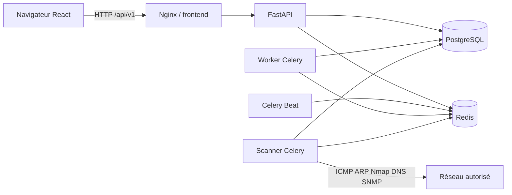
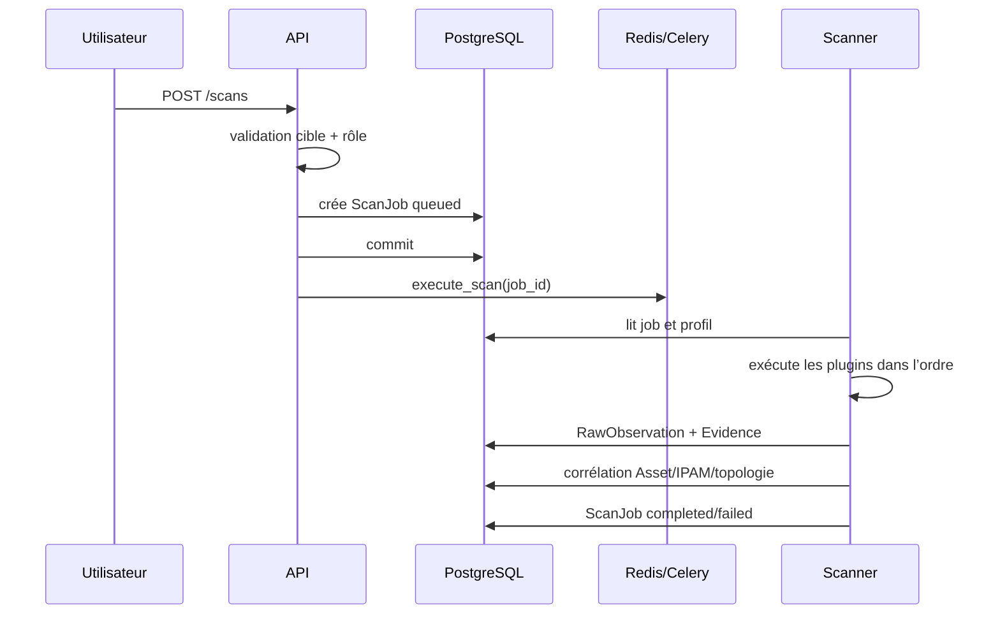

# Architecture de NetScope

Ce document est le point d’entrée technique pour contribuer à NetScope. Il décrit les composants, les flux de données, les invariants métier et les endroits où ajouter une fonctionnalité sans casser la chaîne de découverte.

## Vue d’ensemble

NetScope sépare l’interface, l’API de gestion et l’exécution réseau privilégiée.



| Composant | Code principal | Responsabilité |
| --- | --- | --- |
| Frontend | `frontend/src` | Navigation, formulaires, visualisation et appels API. |
| Proxy web | `frontend/nginx.conf` | Sert le build React, transmet `/api`, pose les en-têtes de sécurité. |
| API | `backend/app/main.py`, `app/api/router.py` | Authentification, RBAC, validation métier et CRUD. Aucun outil réseau n’y est lancé. |
| Worker | `backend/app/workers/tasks.py` | Rapports planifiés et tâches Celery non privilégiées. |
| Scheduler | même module, processus Celery Beat | Déclenche chaque minute le traitement des planifications arrivées à échéance. |
| Scanner | `backend/Dockerfile.scanner`, `app/discovery` | Exécute les plugins réseau dans une file Celery dédiée. |
| PostgreSQL | `app/models/entities.py` | Source de vérité durable. |
| Redis | configuration Celery et limitation de connexion | Broker de tâches, résultats Celery et compteurs temporaires. |

## Parcours d’une requête web

1. Le navigateur appelle `frontend/src/lib/api.ts`, qui ajoute le JWT stocké localement.
2. Nginx transmet `/api/*` à FastAPI.
3. `current_user` décode le JWT et vérifie que son `jti` correspond à une `UserSession` active.
4. `require(...)` applique le rôle `admin`, `operator` ou `viewer`.
5. Le routeur valide le schéma Pydantic, modifie les modèles SQLAlchemy et ajoute si nécessaire un `AuditLog`.
6. La session SQL est commitée avant que la réponse soit renvoyée.

Les secrets SNMP ne sont jamais renvoyés. Ils sont chiffrés dans `Credential.encrypted_secret` par `app/core/secrets.py`; la clé maître reste dans l’environnement.

## Parcours d’un scan



Un `ScanProfile` contient une liste ordonnée de modules et leurs options. Les modules actuels sont ICMP, ARP, Nmap, DNS et SNMP. Pour une cible CIDR, DNS et SNMP travaillent sur les hôtes découverts par les modules précédents; ils n’interrogent pas aveuglément toutes les adresses.

### Contrat d’un plugin de découverte

Tous les plugins héritent de `DiscoveryPlugin` dans `app/discovery/base.py` et implémentent :

```python
async def discover(target: str, options: dict) -> list[DiscoveryResult]
```

Un `DiscoveryResult` contient :

- `source` : nom stable du plugin ;
- `target` : adresse ou cible observée ;
- `raw` : résultat brut sérialisable en JSON ;
- `facts` : faits normalisés `{field, value, confidence}`.

Les commandes externes doivent être appelées avec `asyncio.create_subprocess_exec` et une liste d’arguments. Ne construisez jamais une commande shell par concaténation.

## Pipeline de données et corrélation

```text
DiscoveryResult
  └─ RawObservation (preuve brute conservée)
       └─ Evidence (faits sourcés et pondérés)
            └─ correlate()
                 ├─ Asset / AssetAddress / AssetIdentifier
                 ├─ AssetService / AssetHistory
                 ├─ IpamAddress
                 └─ infrastructure SNMP et topologie
```

Principaux invariants :

- une adresse IP n’est pas une identité durable ; la MAC est recherchée avant l’IP ;
- les observations brutes ne sont pas remplacées par les valeurs normalisées ;
- chaque changement d’identité utile produit un historique ;
- un champ d’identité verrouillé manuellement n’est pas écrasé par une découverte ;
- une adresse découverte est reliée au préfixe IPAM le plus pertinent lorsqu’il existe ;
- les scans réseau ne sont autorisés que par `app/services/safety.py`.

## Modèle de données par domaine

| Domaine | Modèles importants |
| --- | --- |
| Identité et sécurité | `User`, `UserSession`, `UserMfa`, `AuditLog` |
| Découverte | `ScanProfile`, `ScanJob`, `ScanSchedule`, `RawObservation`, `Evidence` |
| Inventaire | `Asset`, `AssetAddress`, `AssetIdentifier`, `AssetService`, `AssetMetadata`, `AssetHistory`, `AssetArchive` |
| IPAM | `Site`, `Subnet`, `Vrf`, `Vlan`, `IpamPrefix`, `IpamAddress`, `IpRange`, `DhcpReservation` |
| Infrastructure | `NetworkDevice`, `SwitchPort`, `PortMacEntry`, `ArpEntry` |
| Topologie | `TopologyNode`, `TopologyLink` |
| Exploitation | `ReportSchedule`, `ConfigurationVersion`, `Credential` |

Les définitions vivent dans `backend/app/models/entities.py`. Toute modification persistante doit avoir une révision Alembic dans `backend/alembic/versions` et un test de migration.

## Planifications et garanties

Celery Beat publie `dispatch_due_schedules` toutes les 60 secondes. Le dispatcher :

1. sélectionne les planifications actives arrivées à échéance ;
2. crée et committe les `ScanJob` avant leur publication dans Redis ;
3. avance la prochaine exécution ;
4. remet une planification à cinq minutes si la publication échoue ;
5. laisse Celery retenter jusqu’à trois fois un rapport en échec SMTP.

Le worker standard écoute `default`; le scanner écoute exclusivement `scanner`. `execute_scan` doit toujours être routé vers cette dernière file.

## Structure du dépôt

```text
backend/
  alembic/                 migrations de schéma
  app/api/                 routes HTTP
  app/core/                configuration, JWT, chiffrement, logs
  app/correlation/         fusion des observations en actifs
  app/discovery/           plugins réseau et parseurs
  app/models/              modèles SQLAlchemy
  app/schemas/             contrats Pydantic
  app/services/            logique IPAM, topologie, constructeurs
  app/workers/             tâches Celery et planificateur
  tests/                   tests unitaires et migrations
frontend/
  src/components/          structure partagée
  src/lib/api.ts           client API et session navigateur
  src/pages/               pages fonctionnelles
  tests/                   scénarios Playwright
docs/                      architecture et exploitation
data/oui/                  source OUI hors ligne
```

## Ajouter une fonctionnalité

### Nouveau champ ou objet persistant

1. Modifier le modèle SQLAlchemy.
2. Ajouter une migration Alembic incrémentale et réversible.
3. Ajouter les schémas Pydantic d’entrée/sortie.
4. Implémenter l’API et son contrôle de rôle.
5. Ajouter un `AuditLog` pour toute action administrative.
6. Couvrir base neuve et mise à niveau d’une base existante.

### Nouveau plugin réseau

1. Créer `app/discovery/<nom>/plugin.py`.
2. Respecter le contrat `DiscoveryResult` et rendre `raw` sérialisable.
3. Enregistrer le plugin dans `app/workers/tasks.py`.
4. Ajouter un parseur pur et ses fixtures plutôt qu’un test sur un réseau vivant.
5. Ajouter le module aux profils uniquement si son ordre d’exécution est explicite.

### Nouvelle page

1. Créer un composant dans `frontend/src/pages`.
2. L’ajouter en chargement différé dans `main.tsx`.
3. Ajouter la navigation dans `components/Layout.tsx` selon le rôle.
4. Traiter les erreurs API et les états vide/chargement.
5. Ajouter un scénario Playwright si le parcours est critique.

## Validation avant contribution

```bash
cd backend && pytest
cd frontend && npm ci && npm run build && npm run test:e2e
docker compose config -q
docker compose up -d --build
curl --fail http://localhost:8080/health
```

Vérifiez aussi `alembic upgrade head` sur une base temporaire et ne commitez jamais `.env`, une sauvegarde, des identifiants ou des résultats réseau sensibles.

## Documents complémentaires

- [Développement local](../DEVELOPMENT.md)
- [Installation et exploitation](../README.md)
- [Reverse proxy HTTPS](REVERSE_PROXY.md)
- [Matrice des permissions](PERMISSIONS.md)
- [Feuille de route](ROADMAP.md)
